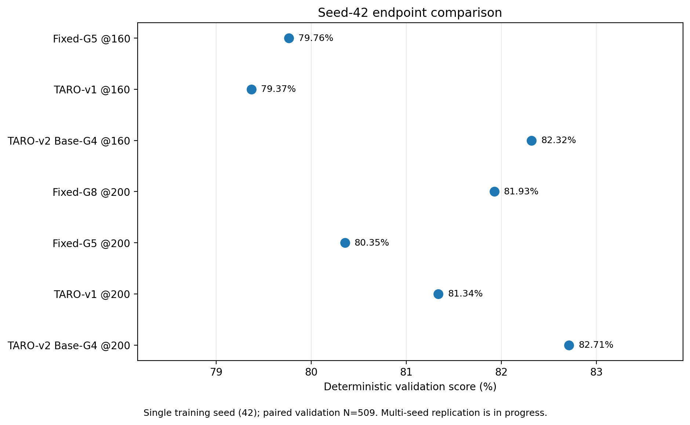
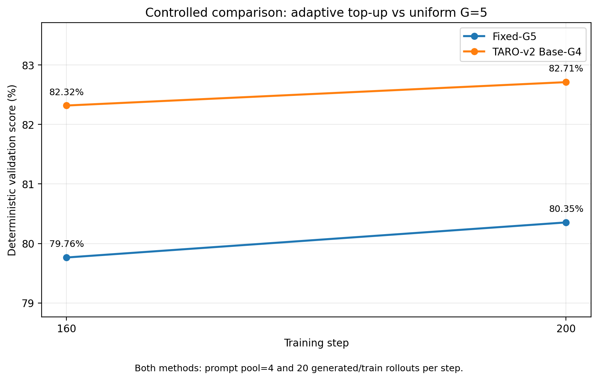
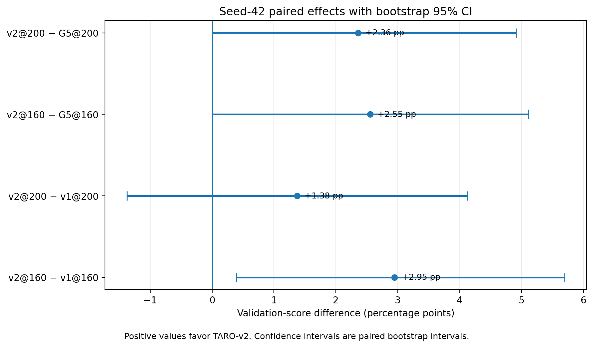

# Event-TARO

**Event-Driven Adaptive Rollout Allocation for GRPO-style LLM Reinforcement Learning**

Event-TARO is a research implementation of an online, event-driven rollout scheduler for LLM reinforcement learning. It is built on top of `verl` and is designed for GRPO-style training where multiple responses are sampled for each prompt.

Instead of assigning the same fixed number of rollouts to every prompt, Event-TARO treats rollout generation as an online resource-allocation problem:

> Whenever a generation slot becomes available, allocate it to the prompt with the highest estimated marginal learning value after accounting for its marginal impact on the active rollout workload.

The current public version uses a **learning-aware + system-aware** scheduling score with:

```text
lambda_time = 0.02
```

This repository contains the current Event-TARO implementation only. Model checkpoints and experiment-result artifacts are intentionally not included.

---

## Results

> **Status:** single-seed results (`seed=42`). Multi-seed replication is in progress, so the numbers below should be treated as preliminary rather than as a final statistical claim.

### Endpoint comparison



| Method | Step | Generated rollouts / step | Total generated rollouts | Train rollouts / step | Validation score |
|---|---:|---:|---:|---:|---:|
| Fixed-G5 @160 | 160 | 20 | 3200 | 20 | 79.76% |
| TARO-v1 @160 | 160 | 20 | 3200 | variable (~18) | 79.37% |
| TARO-v2 Base-G4 @160 | 160 | 20 | 3200 | 20 | 82.32% |
| Fixed-G8 @200 | 200 | 16 | 3200 | 16 | 81.93% |
| Fixed-G5 @200 | 200 | 20 | 4000 | 20 | 80.35% |
| TARO-v1 @200 | 200 | 20 | 4000 | variable (~18) | 81.34% |
| TARO-v2 Base-G4 @200 | 200 | 20 | 4000 | 20 | 82.71% |

### Controlled comparison: TARO-v2 Base-G4 vs Fixed-G5



The cleanest controlled comparison keeps the prompt pool, rollout budget, training-step count, and number of train rollouts matched:

- **@200:** TARO-v2 Base-G4 improves over Fixed-G5 by **+2.36 pp**, paired bootstrap 95% CI **[+0.00, +4.91] pp**, exact McNemar `p=0.088`.
- **@160:** TARO-v2 Base-G4 improves over Fixed-G5 by **+2.55 pp**, paired bootstrap 95% CI **[+0.00, +5.11] pp**, exact McNemar `p=0.079`.

### Structural ablation



Removing the early hard prompt-admission stage and using mandatory Base-G4 yields:

- **v2@200 − v1@200:** **+1.38 pp**, 95% CI **[-1.38, +4.13] pp**.
- **v2@160 − v1@160:** **+2.95 pp**, 95% CI **[+0.39, +5.70] pp**.

All endpoint evaluations use the same deterministic validation setup with paired `N=509`.

## 1. Motivation

A standard fixed-$G$ GRPO pipeline allocates the same number of responses to every prompt:

```math
G_1 = G_2 = \cdots = G_B = G.
```

However, prompts can differ substantially in:

- reward uncertainty;
- response length;
- generation latency;
- the amount of useful group-relative learning signal;
- the marginal cost of adding one more rollout.

Event-TARO therefore replaces fixed per-prompt rollout allocation with a dynamic scheduler.

For prompt $i$, the current implementation scores an additional rollout using:

```math
S_i
=
\Delta U_i
-
\lambda_{\text{time}} C_i,
```

where:

- $\Delta U_i$ is a heuristic marginal learning-utility term;
- $C_i$ is the normalized marginal makespan cost under the current active workload;
- $\lambda_{\text{time}} = 0.02$ in the current version.

The scheduler is re-evaluated after rollout-completion events rather than only after a fully synchronous rollout stage.

---

## 2. Event-Driven Scheduling

Event-TARO uses asynchronous rollout execution.

A training step proceeds conceptually as follows:

```text
Prompt pool
    |
    v
Pilot rollouts
    |
    v
Active rollout set
    |
    | FIRST_COMPLETED
    v
Rollout completion event
    |
    +-- update reward observations
    +-- update response-length estimate
    +-- update active workload
    +-- update trainability reservation
    |
    v
Re-score feasible candidates
    |
    +-- learning utility
    +-- marginal makespan cost
    +-- activation constraint
    +-- Gmin / Gmax constraint
    +-- bounded speculative windows
    |
    v
Dispatch the best candidate
    |
    +-----------------------> next completion event
```

The process continues until the per-step rollout budget is exhausted.

---

## 3. Prompt State

For each prompt, Event-TARO maintains online state including:

- observed rewards;
- observed response lengths;
- completed rollout count;
- in-flight rollout count;
- total dispatched rollout count;
- selected / unselected status;
- pilot utility snapshot;
- commit-stage speculative rollout count;
- adaptive-stage speculative rollout count.

This state is updated whenever a rollout finishes.

---

## 4. Learning Utility

The current implementation assumes binary or binary-like rewards and estimates prompt uncertainty from a Beta posterior.

For observed rollout outcomes with:

- $s$ successes;
- $f$ failures;

the posterior parameters are:

```math
a = 1+s,\qquad b = 1+f.
```

Event-TARO uses the posterior expectation of Bernoulli outcome variance:

```math
U_i
=
\mathbb{E}[p(1-p)]
=
\frac{ab}
{(a+b)(a+b+1)}.
```

This is **not** the variance of the Beta posterior itself. It is the posterior expectation of the Bernoulli outcome variance.

The current implementation converts this prompt-level utility into a diminishing-return heuristic:

```math
\Delta U_i
=
\frac{U_i}
{G_i^{\text{effective}}+1},
```

where:

```math
G_i^{\text{effective}}
=
G_i^{\text{completed}}
+
G_i^{\text{inflight}}.
```

This utility is one concrete implementation of Event-TARO's scheduling interface; it is not intended to define the only possible learning-value estimator.

---

## 5. Marginal Makespan Cost

Event-TARO also models the runtime impact of allocating an additional rollout.

The current implementation uses an empirical marginal-makespan lookup table:

```text
cost_model/makespan_v2_results.csv
```

The table represents the measured change in makespan for candidate response lengths under different background loads.

For an active set of predicted response lengths, Event-TARO first converts the workload into an equivalent number of 8192-token long jobs:

```math
L_{\text{eq}}
=
\sum_j
\frac{\min(\hat{\ell}_j,8192)}
{8192}.
```

It then estimates the marginal makespan increase of the candidate rollout and normalizes it by the reference cost of a standalone 8192-token request:

```math
C_i
=
\frac{
\Delta T_{\text{makespan},i}
}{
T_{\text{reference}}
}.
```

The final scheduler score in the current release is therefore:

```math
\boxed{
S_i
=
\frac{U_i}{G_i^{\text{effective}}+1}
-
0.02\,C_i
}
```

Candidate response length is estimated from previously observed response lengths for that prompt. Before observations are available, the default predicted length is 4096 tokens.

---

## 6. Pilot Rollouts and Activation

Each prompt first receives a small pilot allocation.

The current configuration uses:

```text
pilot_g = 2
```

After the pilot stage, Event-TARO may activate prompts for further rollout allocation.

Once the minimum number of selected prompts has already been reached, a previously unselected prompt must pass an activation gate based on its matched-pilot utility snapshot:

```math
U_{\text{pilot,new}}
>
\min_j U_{\text{pilot},j}
+
\epsilon.
```

The current release uses:

```text
activation_epsilon = 1e-6
```

Using matched pilot snapshots avoids directly comparing an unselected low-$G$ prompt against selected prompts whose posterior utilities have already changed after additional rollout observations.

---

## 7. Trainability Reservation

Dynamic scheduling must not spend the rollout budget in a way that leaves the final GRPO batch untrainable.

Event-TARO therefore maintains a rollout-budget reservation invariant.

Before dispatching an additional rollout, the scheduler accounts for:

1. rollout debt required for already selected prompts to reach $G_{\min}$;
2. rollout budget required to activate enough future groups to satisfy `min_selected`.

Only candidates that preserve these obligations are considered feasible.

The current configuration uses:

```text
Gmin = 4
Gmax = 8
min_selected = 3
total_budget = 20
```

At the end of a valid Event-TARO step:

- the total generation budget is exhausted;
- the minimum number of trainable groups is satisfied;
- every selected group reaches at least $G_{\min}$;
- no group exceeds $G_{\max}$;
- the final reservation debt is zero.

---

## 8. Bounded Speculative Dispatch

Purely sequential adaptive scheduling can leave generation capacity idle while the scheduler waits for fresh rewards.

Event-TARO therefore permits a bounded number of reward-unobserved rollouts to be in flight.

The current release distinguishes two stages.

### Commit Window

The commit window controls speculative dispatch while a selected prompt progresses from the pilot stage toward $G_{\min}$.

```text
commit_window = 2
```

### Adaptive Window

After the prompt has committed enough rollout budget to reach the trainable group size, the adaptive window limits additional speculative post-$G_{\min}$ rollouts.

```text
adaptive_window = 2
```

These windows trade off:

```math
\text{decision freshness}
\quad\leftrightarrow\quad
\text{generation concurrency}.
```

---

## 9. Current Reference Configuration

The current Event-TARO release uses the following scheduler configuration:

| Parameter | Value |
|---|---:|
| Prompt pool size | 4 |
| `pilot_g` | 2 |
| `gmin` | 4 |
| `gmax` | 8 |
| `min_selected` | 3 |
| `total_budget` | 20 |
| `max_inflight` | 16 |
| `commit_window` | 2 |
| `adaptive_window` | 2 |
| `activation_epsilon` | `1e-6` |
| `lambda_time` | **0.02** |
| Default predicted response length | 4096 |
| Maximum response length in the reference setup | 8192 |

These values describe the current released implementation and its reference training script.

---

## 10. Integration with `verl`

The current implementation is based on `verl v0.7.1`.

Event-TARO intentionally keeps its modifications to upstream `verl` small.

### New source files

```text
sources/taro_event_manager.py
    -> verl/experimental/agent_loop/taro_event_manager.py
sources/taro_event_online.py
    -> verl/trainer/ppo/taro_event_online.py
```

### Upstream modification

```text
patches/verl_event_taro.patch
```

The patch modifies:

```text
verl/trainer/ppo/ray_trainer.py
```

The trainer hook selects between:

- the standard `verl` rollout path; and
- the Event-TARO variable-$G$ rollout path.

When Event-TARO is disabled, the original fixed-rollout generation path remains available.

---

## 11. Variable-$G$ Training Batch Reconstruction

Event-TARO generates a fixed total rollout budget per step but can allocate different numbers of rollouts to different prompts.

After scheduling finishes:

1. selected prompt groups are collected;
2. rollouts belonging only to rejected pilot groups are excluded from the training batch;
3. the selected variable-$G$ responses are reconstructed into a valid `verl` `DataProto`;
4. the original prompt `uid` is preserved for GRPO group normalization;
5. Event-TARO diagnostic IDs are added for tracing.

The bridge then returns a self-contained variable-$G$ PPO/GRPO batch to the normal trainer.

---

## 12. Trace and Runtime Metrics

Event-TARO writes a detailed JSONL trace for every training step.

The trace includes:

- prompt-level rewards;
- prompt-level response lengths;
- pilot utilities;
- selected prompts;
- final generated $G$ for every prompt;
- rollout-completion events;
- scheduling decisions;
- predicted response lengths;
- marginal makespan costs;
- reservation state before and after dispatch;
- rollout time;
- average active-request count.

Typical runtime metrics exposed to `verl` include:

```text
taro_event/generated_rollouts
taro_event/train_rollouts
taro_event/dropped_rollouts
taro_event/num_selected
taro_event/final_g_min
taro_event/final_g_mean
taro_event/final_g_max
taro_event/rollout_time_s
taro_event/avg_active
taro_event/max_inflight
taro_event/commit_window
taro_event/adaptive_window
taro_event/final_reserved_rollouts
```

The detailed trace file is:

```text
<taro_log_dir>/taro_event_decisions.jsonl
```

---

## 13. Recommended Repository Layout

```text
Event-TARO/
├── README.md
├── LICENSE
├── .gitignore
├── requirements.txt
│
├── sources/
│   ├── taro_event_manager.py
│   └── taro_event_online.py
│
├── patches/
│   └── verl_event_taro.patch
│
├── scripts/
│   ├── install_event_taro.sh
│   ├── run_taro_event_smoke.sh
│   └── run_taro_event_train.sh
│
├── cost_model/
│   ├── makespan_v2_results.csv
│   └── benchmark_makespan.py
│
├── rewards/
│   └── taro_math_reward.py
│
├── tests/
│   └── test_activation_gate.py
│
└── docs/
    └── algorithm.md
```

`docs/algorithm.md` is optional for the initial release; the rest of the tree is recommended for a reproducible code release.

---

## 14. Installation

### 14.1 Prepare `verl`

Start from a clean `verl v0.7.1` checkout. For a reproducible release, pin the exact upstream commit used by your environment.

```bash
git clone https://github.com/volcengine/verl.git
cd verl
git checkout <PINNED_VERL_V0.7.1_COMMIT>
```

Install the `verl` dependencies required by your rollout backend and training engine.

The reference Event-TARO setup uses:

- PyTorch;
- CUDA;
- vLLM;
- Megatron;
- FlashAttention;
- TransformerEngine.

Exact versions should be recorded in `requirements.txt` or a separate environment file before release.

### 14.2 Add Event-TARO source files

From the Event-TARO repository:

```bash
cp sources/taro_event_manager.py \
    /path/to/verl/verl/experimental/agent_loop/taro_event_manager.py
cp sources/taro_event_online.py \
    /path/to/verl/verl/trainer/ppo/taro_event_online.py
```

### 14.3 Apply the upstream patch

From the root of the clean `verl` checkout:

```bash
git apply --check /path/to/Event-TARO/patches/verl_event_taro.patch
git apply /path/to/Event-TARO/patches/verl_event_taro.patch
```

Then verify the modified files compile:

```bash
python -m py_compile \
    verl/experimental/agent_loop/taro_event_manager.py \
    verl/trainer/ppo/taro_event_online.py \
    verl/trainer/ppo/ray_trainer.py
```

A release-ready `scripts/install_event_taro.sh` can automate these steps.

---

## 15. Running Event-TARO

The supplied training scripts expect paths for:

- the `verl` checkout;
- the base model;
- the training dataset;
- the validation dataset;
- the reward function;
- the makespan lookup table;
- output/checkpoint directories.

Before publishing the repository, replace machine-specific absolute paths in the scripts with environment-overridable variables or edit the path block near the top of each script.

### Smoke test

Run a short smoke test before starting a full training job:

```bash
TOTAL_STEPS=2 bash scripts/run_taro_event_smoke.sh
```

Then run a longer scheduler stability test if desired:

```bash
TOTAL_STEPS=10 bash scripts/run_taro_event_smoke.sh
```

### Reference training

```bash
bash scripts/run_taro_event_train.sh
```

The reference script enables Event-TARO through:

```text
trainer.taro_online.enabled = true
```

and selects:

```text
verl.experimental.agent_loop.taro_event_manager.TAROEventAgentLoopManager
```

as the rollout agent-loop manager.

---

## 16. Cost-Model Calibration

The current release requires:

```text
cost_model/makespan_v2_results.csv
```

This file is a **runtime calibration asset**, not a model-quality result.

The expected columns are:

```text
background_long_jobs
candidate_tokens
delta_makespan_s
```

`benchmark_makespan.py` should be included so that users can reproduce or recalibrate the table on different hardware.

Because runtime characteristics depend on GPU, vLLM version, model, batching configuration, and maximum sequence length, users deploying Event-TARO in a different environment should consider rebuilding the cost table.

---

## 17. Reward Function

The included mathematical-reasoning example uses:

```text
rewards/taro_math_reward.py
```

Event-TARO itself is not tied to a particular reward function.

The scheduler currently expects reward observations that can be interpreted as success/failure for the Beta-based utility calculation. For non-binary reward settings, the utility estimator should be adapted accordingly.

---

## 18. What Is Not Included

The public source release should not include:

- base-model weights;
- training checkpoints;
- generated rollout dumps;
- validation outputs;
- experiment comparison CSV files;
- result plots;
- Ray/vLLM runtime logs;
- local caches;
- `.pyc` / `__pycache__`;
- backup copies of modified `verl` files;
- machine-specific wheel caches.

These artifacts are not required to understand or install the Event-TARO scheduler.

---

## 19. Implementation Notes

The current release should use the **runtime version** of:

```text
verl/experimental/agent_loop/taro_event_manager.py
```

that was used for the reference Event-TARO training configuration.

Do not publish older development copies or backup files such as:

```text
taro_event_manager.py.before_*.bak
ray_trainer.py.pre_taro_*
ray_trainer.py.before_event_taro
```

The upstream modification should be represented by:

```text
patches/verl_event_taro.patch
```

rather than by publishing a complete modified copy of the `verl` repository.

---

## 20. License

Choose a project license that is compatible with the code you publish, and retain the licenses and attribution requirements of `verl`, the base model, datasets, and other third-party dependencies.

---

## Citation

Citation information can be added when the corresponding paper or technical report is publicly available.

```bibtex
@misc{eventtaro,
  title  = {Event-TARO: Event-Driven Adaptive Rollout Allocation for GRPO-style LLM Reinforcement Learning},
  author = {...},
  year   = {...}
}
```
